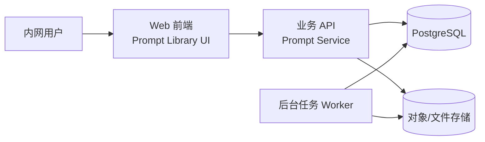

# 技术方案与架构设计

方案版本：v1
日期：2026-04-23

## 1. 方案目标

基于 `Open WebUI` 做定制化改造，交付一个适用于内网的 Prompt 管理系统，满足以下目标：

- 用户看到的是“Prompt 库”，不是通用 AI 平台
- 支持分类、搜索、标签、详情、复制
- 支持版本历史、回滚、变更说明
- 支持点赞/评分
- 支持用户提交更新并进入审核流
- 支持管理员审核发布
- 支持单机 Docker Compose 部署

## 2. 方案边界

### 2.1 一期要做

- 分类导航
- Prompt 列表页
- Prompt 详情页
- 一键复制
- 版本历史展示
- 投稿更新
- 审核流
- 点赞/评分
- 基础权限
- 操作日志

### 2.2 一期不做

- 模型评测
- A/B Prompt 实验
- 生产环境 SDK 动态下发
- 工作流编排
- RAG 知识库
- 多租户隔离
- 对接企业 SSO 以外的复杂组织模型

## 3. 总体架构



说明：

- 前端展示为“Prompt 库”界面，尽量隐藏 Open WebUI 中与聊天、工具、知识库无关的入口。
- 业务 API 统一负责 Prompt 元数据、点赞、审核流、版本索引。
- Prompt 正文快照与附加元数据可存储在文件目录或对象存储中。
- PostgreSQL 保存结构化元数据，文件存储保存版本快照正文。

## 4. 模块设计

### 4.1 Prompt 分类模块

职责：

- 管理一级分类、二级分类
- 控制列表页筛选与排序
- 支持后台维护分类启停

建议字段：

- `id`
- `name`
- `slug`
- `parent_id`
- `sort_order`
- `status`

### 4.2 Prompt 主体模块

职责：

- 管理 Prompt 卡片信息
- 维护当前发布版本
- 承载浏览、搜索、筛选、复制

建议字段：

- `id`
- `title`
- `slug`
- `summary`
- `category_id`
- `tags`
- `status`：`draft` / `published` / `archived`
- `current_version_id`
- `likes_count`
- `score_avg`
- `created_by`
- `created_at`
- `updated_at`

### 4.3 Prompt 版本模块

职责：

- 维护版本历史
- 保存变更说明
- 记录谁提交、谁审核、何时发布

建议字段：

- `id`
- `prompt_id`
- `version_no`
- `content`
- `change_note`
- `source_type`：`create` / `edit` / `submission` / `rollback`
- `status`：`pending` / `approved` / `rejected`
- `submitted_by`
- `reviewed_by`
- `submitted_at`
- `reviewed_at`

实现建议：

- 数据模型借鉴 `yinpu/prompt_manager` 的 `Project > Prompt > Version` 思路。
- 每个 Prompt 保持单调递增版本号，例如 `v0001`、`v0002`。
- 正文可以同时保存在数据库和文件快照目录；数据库便于检索，文件便于审计和备份。

### 4.4 点赞/评分模块

职责：

- 记录用户点赞
- 可选支持 1 到 5 星评分
- 生成热门排序指标

建议字段：

- `prompt_like`
  - `id`
  - `prompt_id`
  - `user_id`
  - `created_at`
- `prompt_rating`
  - `id`
  - `prompt_id`
  - `user_id`
  - `score`
  - `created_at`

业务规则：

- 点赞一人一票，可取消。
- 评分可后续启用；一期若想简化，可只保留点赞。

### 4.5 投稿审核模块

职责：

- 允许普通用户基于当前版本提交改进版
- 管理员审核通过后成为新发布版本

流程：

1. 用户打开 Prompt 详情页，点击“提交更新”
2. 系统加载当前已发布版本内容
3. 用户修改内容并填写变更说明
4. 系统生成 `pending` 版本
5. 管理员审核
6. 通过后写入 `approved` 并切换为当前版本
7. 拒绝后记录原因

### 4.6 审计日志模块

记录以下操作：

- 创建 Prompt
- 编辑 Prompt
- 提交版本
- 审核通过/拒绝
- 回滚版本
- 点赞/取消点赞

## 5. 权限设计

角色分为三类：

- `viewer`
  - 浏览、搜索、复制、点赞
- `editor`
  - 提交更新、创建草稿
- `admin`
  - 分类管理、Prompt 发布、审核、归档、回滚

权限设计原则：

- 读权限尽量放开，写权限收敛
- 版本发布必须经过管理员或受信编辑审核
- 审核与发布动作必须留痕

## 6. 页面设计

### 6.1 首页

- 左侧分类导航
- 顶部搜索框
- 中间 Prompt 卡片列表
- 支持按最新、最热、点赞数排序

### 6.2 详情页

- 标题、摘要、标签、分类
- 当前版本正文
- 一键复制
- 点赞按钮
- 版本历史 Tab
- 提交更新入口

### 6.3 管理后台

- 分类管理
- Prompt 审核队列
- Prompt 编辑器
- 版本对比视图
- 操作日志列表

## 7. API 设计草案

### Prompt 列表

- `GET /api/prompts`
- 支持参数：
  - `keyword`
  - `category`
  - `tag`
  - `sort=latest|popular|liked`
  - `page`
  - `page_size`

### Prompt 详情

- `GET /api/prompts/{slug}`

### 当前版本复制

- `GET /api/prompts/{slug}/content`

### 版本列表

- `GET /api/prompts/{slug}/versions`

### 提交更新

- `POST /api/prompts/{slug}/submissions`

请求体建议：

```json
{
  "content": "新的提示词内容",
  "change_note": "补充更明确的输出格式约束"
}
```

### 审核通过

- `POST /api/admin/submissions/{id}/approve`

### 审核拒绝

- `POST /api/admin/submissions/{id}/reject`

### 点赞

- `POST /api/prompts/{slug}/like`
- `DELETE /api/prompts/{slug}/like`

## 8. 存储设计

### 8.1 PostgreSQL

用途：

- 用户
- 分类
- Prompt 主表
- 版本索引
- 点赞记录
- 审核流
- 操作日志

### 8.2 文件/对象存储

用途：

- 版本正文快照
- 导入导出文件
- 后续可扩展为附件存储

推荐目录结构：

```text
/data/prompts/{prompt_slug}/v0001/prompt.txt
/data/prompts/{prompt_slug}/v0001/meta.json
/data/prompts/{prompt_slug}/v0002/prompt.txt
/data/prompts/{prompt_slug}/v0002/meta.json
```

## 9. 非功能要求

### 9.1 安全

- 内网入口必须经反向代理统一暴露
- 生产环境强制更换默认密钥
- 审核操作必须记录操作者和时间
- 禁止匿名写操作

### 9.2 可维护性

- 单机 Compose 优先
- 业务 API 与前端容器解耦
- 文件存储使用挂载卷，保证升级不丢数据

### 9.3 性能

- 列表页目标：P95 响应时间小于 500ms
- 单机支持 50 到 100 内网并发浏览用户
- 点赞、列表、详情查询都应有索引

## 10. 技术决策

### 10.1 为什么不直接裸用 Open WebUI

因为当前目标是 Prompt 管理产品，而不是聊天入口。直接裸用会带入过多无关导航与概念，最终影响易用性。

### 10.2 为什么不完全自研

因为一期目标更看重“尽快上线试运行”。在权限、用户、版本能力已有基础的前提下，基于 Open WebUI 改造更快。

### 10.3 为什么借鉴 yinpu/prompt_manager

因为它的版本模型足够简单、稳定、易理解，适合落到文件快照和审计场景。

## 11. 演进路线

### 一期

- 可浏览、可复制、可点赞、可投稿、可审核、可回滚

### 二期

- Prompt diff 对比
- 批量导入导出
- 企业 SSO
- 版本质量评估
- 发布标签，例如 `dev` / `staging` / `prod`

### 三期

- Prompt 与应用运行数据联动
- A/B 实验
- 使用效果统计面板
- 与 Langfuse 一类平台对接

## 12. 参考仓库

- Open WebUI: https://github.com/open-webui/open-webui
- Langfuse: https://github.com/langfuse/langfuse
- Dify: https://github.com/langgenius/dify
- yinpu/prompt_manager: https://github.com/yinpu/prompt_manager
