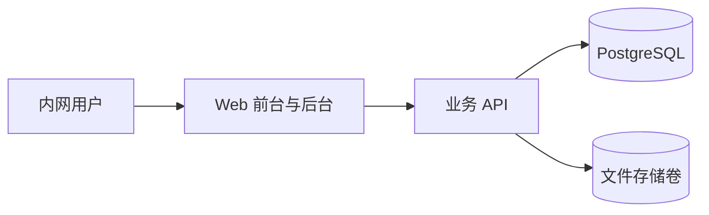
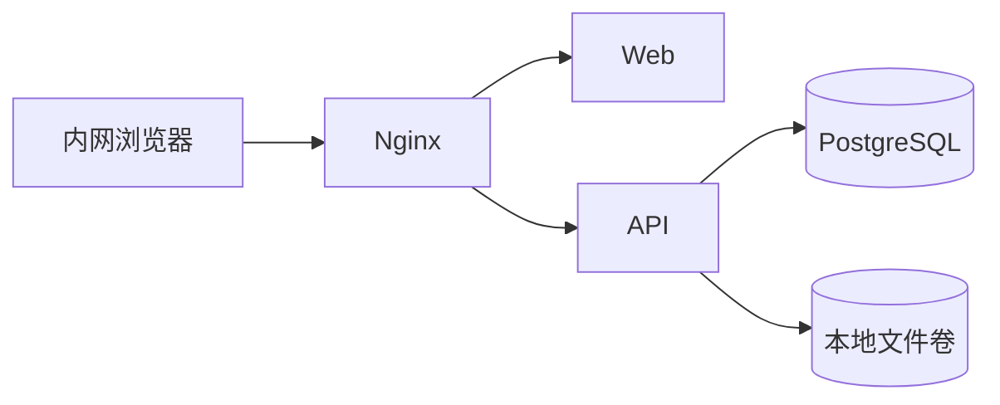

# 方案3B：极简版提示词资产平台设计稿

方案版本：v1.0
日期：2026-04-23
适用阶段：一期立项与研发设计基线

## 1. 背景与目标

### 1.1 背景

当前提示词管理需求已经明确，不再继续评估通用 AI 平台或重型 Prompt 工程平台，而是聚焦建设一套面向内部使用的“极简版提示词资产平台”。该平台的核心价值不是承载复杂编排、模型评测或多租户能力，而是以最低认知负担提供稳定、可维护、可审计的提示词浏览、复制、更新与审核能力。

业务侧已经确认，一期产品定位为“偏使用”的提示词资产库：

- 普通用户以浏览、搜索、复制、提交更新为主。
- 管理员负责分类维护、内容发布、审核与版本治理。
- 系统采用单机 `Docker Compose` 部署，优先满足内网试运行和小规模正式使用。

### 1.2 建设目标

本方案的建设目标如下：

- 交付一套 Cherry 风格网页前台，形成明确的提示词库产品形态。
- 提供左侧分类、顶部搜索、卡片网格列表等高频使用入口，降低查找成本。
- 支持提示词详情查看与一键复制，缩短用户从发现到使用的路径。
- 支持版本历史追溯，保证内容演进有据可查。
- 支持普通用户提交更新，管理员在后台完成审核后发布。
- 提供最小可用的管理员后台，覆盖分类管理、待审核队列和内容维护。
- 使用单机 `Docker Compose` 落地，降低部署复杂度与运维成本。

### 1.3 一期范围

一期纳入范围：

- Cherry 风格前台首页
- 分类浏览与关键词搜索
- 提示词卡片展示与详情页
- 一键复制
- 版本历史查看
- 用户提交更新
- 管理员审核后台
- 基础审计留痕
- 单机 `Docker Compose` 部署

一期不纳入范围：

- 复杂工作流编排
- 模型效果评测与 A/B 实验
- 企业级多租户与组织隔离
- 对外开放 API 平台化能力
- 批量导入导出复杂规则
- 自动化推荐、质量评分、知识库联动

## 2. 设计原则

### 2.1 极简优先

系统以“看得懂、找得到、复制快、更新顺”为第一原则。任何不能直接提升提示词资产使用效率的能力，一期均不主动引入。

### 2.2 使用导向优先于平台导向

前台默认面向使用者，而非运营者或开发者。首页应优先服务“找提示词、看提示词、复制提示词”，后台才承载审核与维护能力。

### 2.3 版本治理优先于自由编辑

提示词内容属于可演进资产，而非随意修改的文本。所有更新都应形成版本记录，普通用户更新进入待审核状态，管理员审核通过后才进入正式发布版本。

### 2.4 单机可运维

部署架构必须控制在单机可维护范围内，避免在一期引入不必要的中间件与复杂编排。数据库、文件存储、应用服务均应支持明确的数据落盘与备份策略。

### 2.5 界面一致性

前台视觉采用已确认的 Cherry 风格，确保信息层级清晰、入口统一、操作反馈直接。后台不追求独立视觉体系，但应保持结构清楚、操作高效。

### 2.6 可审计与可追责

发布、审核、驳回、回滚等关键操作必须具备操作者、时间、对象与结果记录，保证资产治理过程可追溯。

## 3. 架构设计

### 3.1 总体架构

系统采用前后端分层、单机部署的最小可用架构：



架构说明：

- `Web` 统一承载前台页面与管理员后台页面。
- `业务 API` 负责分类、搜索、提示词详情、版本、提交、审核等业务逻辑。
- `PostgreSQL` 保存结构化元数据与流程状态。
- `文件存储卷` 保存提示词版本正文快照，便于审计、备份与恢复。

### 3.2 逻辑模块划分

系统逻辑上划分为以下模块：

- 分类模块：维护左侧分类结构和排序。
- 提示词资产模块：维护提示词主信息、状态和当前发布版本。
- 版本模块：维护每个提示词的历史版本、变更说明和来源。
- 提交模块：接收普通用户的更新提议并进入待审核状态。
- 审核模块：管理员查看差异、通过或拒绝提交。
- 审计模块：记录关键治理动作。

### 3.3 角色与权限

建议采用两类核心角色，避免一期权限模型过度复杂：

- `user`
  - 浏览分类与列表
  - 搜索提示词
  - 查看详情
  - 复制当前版本内容
  - 提交更新建议
- `admin`
  - 拥有 `user` 全部权限
  - 管理分类
  - 创建与编辑提示词
  - 审核用户提交
  - 发布、驳回、归档和回滚版本
  - 查看审计日志

### 3.4 关键设计决策

- 前后台共用同一套应用入口与会话体系，减少部署与维护成本。
- 版本正文采用“数据库索引 + 文件快照”模式，兼顾检索效率与恢复能力。
- 审核流程只保留单级审核，避免一期流程复杂化。
- 搜索聚焦标题、摘要、标签和当前发布版本内容，不做跨历史版本全文检索增强。

## 4. 数据模型

### 4.1 分类 `category`

用途：支撑左侧分类导航与后台分类维护。

建议字段：

- `id`
- `name`
- `slug`
- `parent_id`
- `sort_order`
- `description`
- `status`
- `created_at`
- `updated_at`

说明：

- 一期默认支持一级分类，`parent_id` 预留二级分类扩展能力。
- `status` 建议枚举为 `enabled`、`disabled`。

### 4.2 提示词主体 `prompt`

用途：表示一个可被浏览、复制与治理的提示词资产。

建议字段：

- `id`
- `title`
- `slug`
- `summary`
- `category_id`
- `tags`
- `status`
- `current_version_id`
- `created_by`
- `updated_by`
- `created_at`
- `updated_at`

说明：

- `status` 建议枚举为 `draft`、`published`、`archived`。
- `current_version_id` 指向当前对前台可见的正式版本。

### 4.3 提示词版本 `prompt_version`

用途：保存每次内容变更及其治理状态。

建议字段：

- `id`
- `prompt_id`
- `version_no`
- `content_path`
- `content_snapshot`
- `change_note`
- `source_type`
- `review_status`
- `submitted_by`
- `submitted_at`
- `reviewed_by`
- `reviewed_at`
- `review_comment`

说明：

- `version_no` 建议采用单调递增形式，例如 `v0001`、`v0002`。
- `content_path` 指向文件卷内快照路径。
- `content_snapshot` 可选保存数据库内的冗余文本，便于检索与审阅。
- `source_type` 建议枚举为 `create`、`edit`、`submission`、`rollback`。
- `review_status` 建议枚举为 `pending`、`approved`、`rejected`。

### 4.4 用户提交 `prompt_submission`

用途：显式表示用户提交审核的动作，便于后续扩展审批视图和统计。

建议字段：

- `id`
- `prompt_id`
- `base_version_id`
- `candidate_version_id`
- `submitter_id`
- `status`
- `created_at`
- `updated_at`

说明：

- `candidate_version_id` 指向一条待审核版本记录。
- `status` 与审核结果保持一致，建议枚举为 `pending`、`approved`、`rejected`。

### 4.5 审计日志 `audit_log`

用途：记录关键治理操作。

建议字段：

- `id`
- `actor_id`
- `actor_role`
- `action`
- `target_type`
- `target_id`
- `target_version_id`
- `result`
- `detail`
- `created_at`

重点记录动作：

- 创建提示词
- 编辑提示词
- 提交更新
- 审核通过
- 审核拒绝
- 发布版本
- 回滚版本
- 分类启停

### 4.6 文件存储组织

建议的提示词快照目录如下：

```text
/data/prompts/{prompt_slug}/v0001/prompt.txt
/data/prompts/{prompt_slug}/v0001/meta.json
/data/prompts/{prompt_slug}/v0002/prompt.txt
/data/prompts/{prompt_slug}/v0002/meta.json
```

其中：

- `prompt.txt` 保存版本正文。
- `meta.json` 保存版本号、提交人、审核状态、变更说明等元数据镜像。

## 5. 页面与流程

### 5.1 前台首页

前台首页采用已确认的 Cherry 风格，作为全系统最核心的使用入口。

布局要求：

- 左侧为分类导航区，展示分类列表并支持高亮当前分类。
- 顶部为全局搜索区，支持关键词查询。
- 中间主体为卡片网格区，按统一卡片样式展示提示词资产。
- 顶部右侧保留进入管理后台的入口，仅管理员可见。

卡片信息建议包含：

- 标题
- 分类
- 摘要
- 标签
- 当前版本号
- 最近更新时间
- 复制按钮

### 5.2 提示词详情页

详情页承担“查看、复制、追溯、提交更新”四类职责。

页面模块：

- 基本信息区：标题、分类、标签、更新时间、当前版本号。
- 正文展示区：显示当前发布版本完整内容。
- 操作区：复制、提交更新。
- 版本历史区：展示历史版本列表与版本详情。

关键交互：

- 点击复制后立即反馈复制成功。
- 版本历史默认按时间倒序展示。
- 当前生效版本需要明显标识。
- 点击某个历史版本后，可查看版本号、变更说明、提交时间、审核结果和对应正文。

### 5.3 用户提交更新流程

用户提交更新为一期核心闭环之一，流程如下：

1. 用户在详情页点击“提交更新”。
2. 系统以当前发布版本内容作为初始值打开提交表单。
3. 用户修改提示词内容，并填写变更说明。
4. 系统生成候选版本，状态记为 `pending`。
5. 同时写入一条提交记录，进入管理员审核队列。
6. 提交成功后，前台提示“已提交审核”。

提交表单字段建议：

- 原版本号，只读
- 新内容
- 变更说明

### 5.4 管理员审核后台

管理员后台是一期间唯一管理入口，采用最小可用模块组合。

后台模块建议包括：

- 待审核列表
- 提示词管理
- 分类管理
- 审计日志

其中待审核列表为核心页面，建议展示：

- 提示词标题
- 所属分类
- 提交人
- 提交时间
- 基础版本号
- 候选版本号
- 变更说明摘要
- 审核状态

审核操作流程：

1. 管理员进入后台待审核列表。
2. 查看某条提交的候选内容、基础内容与变更说明。
3. 执行“通过”或“拒绝”。
4. 通过时，将候选版本状态更新为 `approved`，并将其设置为 `current_version_id`。
5. 拒绝时，将候选版本状态更新为 `rejected`，并记录驳回原因。
6. 系统同步写入审计日志。

### 5.5 版本历史与回溯流程

版本历史为资产治理的核心可视化能力，要求具备以下特征：

- 前台详情页可查看历史版本列表。
- 每次提交、审核、发布、回滚都形成独立版本记录。
- 历史版本不可被物理覆盖。
- 当前版本切换必须通过显式发布或回滚动作完成。

### 5.6 关键页面清单

一期建议至少包含以下页面：

- 前台首页
- 提示词详情页
- 提交更新弹窗或独立页
- 管理后台首页
- 待审核列表页
- 分类管理页
- 提示词维护页

## 6. 接口与业务约束

### 6.1 前台接口

建议的最小接口集合如下：

- `GET /api/prompts`
  - 支持 `keyword`、`category`、`page`、`page_size`
- `GET /api/prompts/{slug}`
- `GET /api/prompts/{slug}/versions`
- `POST /api/prompts/{slug}/copy-log`
- `POST /api/prompts/{slug}/submissions`

### 6.2 后台接口

- `GET /api/admin/reviews`
- `POST /api/admin/reviews/{id}/approve`
- `POST /api/admin/reviews/{id}/reject`
- `GET /api/admin/categories`
- `POST /api/admin/categories`
- `PUT /api/admin/categories/{id}`
- `GET /api/admin/prompts`
- `POST /api/admin/prompts`
- `PUT /api/admin/prompts/{id}`

### 6.3 业务约束

- 前台列表只展示 `published` 状态提示词。
- 前台详情默认展示当前发布版本，不展示待审核内容。
- 普通用户不能直接发布新版本。
- 管理员审核通过后，候选版本才能成为正式版本。
- 审核拒绝不能影响当前已发布版本的可用性。
- 归档后的提示词默认不在前台列表展示。

## 7. 部署方案

### 7.1 部署目标

部署方案采用单机 `Docker Compose`，满足以下目标：

- 内网可快速部署与恢复
- 最小化基础设施依赖
- 明确数据目录与备份边界
- 支持前后台统一对外服务

### 7.2 推荐服务拓扑



说明：

- `Nginx` 负责统一入口与反向代理。
- `Web` 承载 Cherry 风格前台及管理员后台页面。
- `API` 承载业务逻辑。
- `PostgreSQL` 保存元数据。
- `本地文件卷` 保存版本正文快照和运行日志。

### 7.3 宿主机目录建议

```text
/opt/prompt-assets/
  compose.yaml
  .env
  nginx/
  data/
    postgres/
    prompts/
    logs/
```

### 7.4 `Docker Compose` 服务清单

一期建议仅包含以下服务：

- `nginx`
- `web`
- `api`
- `postgres`

不建议一期默认引入：

- `redis`
- `worker`
- 外部对象存储

原因是当前业务链路以同步处理为主，额外中间件会提高部署与运维复杂度。

### 7.5 数据持久化要求

- PostgreSQL 数据必须挂载宿主机卷。
- 提示词快照目录必须挂载宿主机卷。
- 配置文件与密钥文件纳入备份清单。
- 升级前必须同时备份数据库和快照目录。

## 8. 风险与边界

### 8.1 产品风险

- 过度追求平台能力会稀释一期目标，导致上线周期失控。
- 如果分类设计不清晰，前台左侧导航会失去检索价值。
- 如果提交与审核反馈不明确，用户会误认为内容已即时生效。

### 8.2 技术风险

- 仅用数据库存正文虽然实现简单，但不利于快照审计和恢复，因此需保留文件卷快照。
- 搜索若直接对长文本做无索引匹配，后续数据量增加后会带来性能压力。
- 若前后台路由和权限隔离不清，可能出现管理员入口暴露或普通用户误入后台的问题。

### 8.3 运行边界

- 一期默认面向内网环境，不处理公网高并发与复杂安全对抗场景。
- 一期仅支持单机部署，不承诺高可用、弹性扩缩容与多节点容灾。
- 一期审核流为单级审批，不支持多级会签。
- 一期不处理复杂导入导出、自动质量评估或跨系统同步。

### 8.4 设计边界

- Cherry 风格前台属于已确认产品基线，不在本设计稿中重新讨论视觉方向。
- 管理后台以实用为优先，不追求重度运营平台化。
- 文档聚焦正式设计落地，不包含具体技术框架选型代码实现。

## 9. 阶段目标

### 9.1 阶段一：设计冻结

目标：

- 冻结信息架构、页面范围、数据模型和部署边界。
- 明确前后台职责与最小业务闭环。
- 形成后续研发、测试与验收统一基线。

交付物：

- 正式设计稿
- 页面清单
- 数据模型草案
- 部署拓扑说明

### 9.2 阶段二：MVP 开发

目标：

- 完成 Cherry 风格前台首页与详情页。
- 打通分类、搜索、卡片列表和复制能力。
- 打通用户提交更新与管理员审核发布闭环。
- 完成单机 `Docker Compose` 部署验证。

验收重点：

- 用户可从首页快速找到目标提示词并复制
- 用户提交更新后可进入待审核队列
- 管理员审核通过后新版本对前台可见
- 历史版本可查看且数据可追溯

### 9.3 阶段三：试运行优化

目标：

- 补齐日志、错误反馈与基础运维检查项。
- 根据使用反馈调整分类结构、搜索效果和后台效率。
- 评估二期是否需要导入能力、差异对比与统计能力。

## 10. 结论

方案3B的本质不是建设一个重型 Prompt 工程平台，而是建设一个以使用效率和资产治理为中心的极简提示词资产平台。其核心设计已经明确：

- 前台采用 Cherry 风格网页形态。
- 首页以左侧分类、顶部搜索、卡片网格作为主结构。
- 详情页承担复制、版本历史查看和更新提交能力。
- 管理员通过审核后台完成分类维护与版本治理。
- 整体以单机 `Docker Compose` 方式落地，满足一期快速上线与低运维复杂度要求。

该设计可作为后续产品细化、接口定义、研发拆解、测试验收和部署实施的正式基线。
