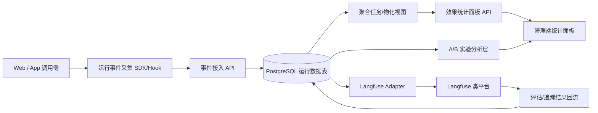

# 2026-04-27 三期运行数据与效果闭环规划

## 0. 背景与输入

本规划基于以下已落盘结论与线索：

- 二期收口结论：`docs/二期最终收口记录-20260424.md`
- 二期 QA 收口：`docs/QA二期收口测试报告-20260424.md`
- 二期多分类收口：`docs/公司提示词库多分类管理-最终收口-20260425.md`
- 近期本地稳定化：`docs/QA收尾报告-2026-04-27-local-debug-3010.md`
- 三期方向基线：`docs/04-技术方案与架构设计.md`（三期：运行数据联动、A/B、效果面板、Langfuse 对接）

---

## 1. 二期结论摘要

1. **主链路能力已完成并具备复验证据**  
- 管理员创建/导入、员工候选提交流、详情聚合卡片、官方/候选复制、真实 DB 管理/详情链路均有通过记录。

2. **二期交付重心完成，但工程治理存在遗留缺口**  
- 历史批次中出现过 `build:web` 红灯反复、真实 DB 并发时端口/容器竞争、CI 覆盖面不足与门禁弱化问题。  
- 二期计划中定义过“接口契约文档补齐”，但仓库未形成统一可版本化契约文档资产。  

3. **当前状态适合进入三期，但应先做前置治理**  
- 三期若直接叠加运行数据、实验与外部平台对接，会放大现有工程不稳定面；需先清治理债。

---

## 2. 三期目标

三期总体目标：构建“Prompt 资产 -> 应用运行 -> 反馈评估 -> 实验迭代 -> 再发布”的闭环。

1. **Prompt 与应用运行数据联动**  
- 可追踪每次应用调用使用了哪个 Prompt、哪个版本、在什么场景、得到什么结果。

2. **A/B 实验能力**  
- 支持同一场景下多个 Prompt 版本/策略并行实验，具备可追溯分流与结果归因。

3. **使用效果统计面板**  
- 提供按 Prompt/版本/场景/时间维度的核心指标看板，支撑运营与研发决策。

4. **Langfuse 类平台对接**  
- 打通最小双向能力：本地事件上报与外部平台追踪 ID/评估结果回流。

---

## 3. 范围边界

### 3.1 三期纳入范围（In Scope）

- Prompt 运行事件模型与采集链路（请求、响应、耗时、错误、用户反馈）。
- 实验模型（实验、变体、分流规则、曝光/转化统计）。
- 统计聚合层与可视化面板（管理端）。
- Langfuse 类平台适配层（先单平台适配，保留扩展接口）。
- 三期前置治理项（见第 4 章）作为开工门槛。

### 3.2 三期不纳入范围（Out of Scope）

- 多租户隔离体系重构。
- 全量数据湖/实时流计算平台建设。
- 复杂多臂老虎机或自动调参系统。
- 一次性对接多个可观测平台（先以 Langfuse 类平台单适配为主）。

---

## 4. 三期前置治理项（承接二期遗留）

> 以下 5 项为三期开工前置，不完成不得进入功能扩展阶段。

### G0-1 `build:web` 红灯治理

- 目标：消除历史“偶发红灯/环境相关红灯”，形成可重复绿灯基线。
- 交付：构建前清理策略、稳定构建脚本、失败归因指引。
- 验收：连续 10 次本地+CI 构建通过率 100%。

### G0-2 CI 门禁不足治理

- 目标：把“发布相关主链路”纳入 PR 必经门禁，而非局部或手工触发。
- 交付：统一 `phase3-core-verify` 工作流（`build:web`、关键 integration、关键 e2e、契约校验）。
- 验收：PR 无法绕过门禁直接合并；任一关键链路回归可被阻断。

### G0-3 接口契约文档缺失治理

- 目标：形成可版本化、可审计的 API 契约资产（含错误码/示例）。
- 交付：`docs/contracts/` 目录与首批契约文档（运行事件、实验、统计、对接回调）。
- 验收：前后端/测试按契约独立实现，抽样接口一致性检查通过。

### G0-4 端口/容器竞争治理

- 目标：解决并发测试与本地调试中的端口/容器名竞争。
- 交付：容器命名隔离策略、并发测试编排规则、冲突检测与 fail-fast 提示。
- 验收：并发执行关键测试集 5 轮无容器名冲突与端口占用失败。

### G0-5 首页创建/导入入口提示治理

- 目标：统一首页到管理创建/导入链路的提示与引导，避免“能点但认知不清”。
- 交付：首页入口文案与空态提示规范、跳转后状态反馈规范。
- 验收：新用户走查可在 1 分钟内完成“从首页进入创建/导入并看到明确反馈”。

---

## 5. 架构设计

### 5.1 架构原则

- 保持单仓单体演进（Next.js + PostgreSQL + Compose），不新增重型基础设施。
- 先采集再聚合，先离线准实时再实时化。
- 所有实验与效果指标必须可追溯到 Prompt 版本与调用上下文。

### 5.2 逻辑架构

### 5.3 数据域设计（最小集）

- `prompt_run_event`：一次调用事件（prompt_id、version_id、scene、trace_id、latency、status、tokens、error_code）。
- `prompt_run_feedback`：显式反馈（like/dislike/人工评分/业务结果标签）。
- `prompt_ab_experiment`：实验定义（实验名、目标、开始/结束、状态）。
- `prompt_ab_variant`：变体定义（版本映射、权重）。
- `prompt_ab_assignment`：分流记录（user/session -> variant）。
- `prompt_effect_daily`：日聚合指标（曝光、成功率、错误率、P95、反馈得分）。

### 5.4 对接策略（Langfuse 类平台）

- 采用“适配器层”而非业务代码直连，统一封装上报与回流协议。
- 第一阶段仅对接：trace/span + prompt/version 标签 + 基础评分字段。
- 回流策略：定时拉取外部评估结果，按 `trace_id` 归并到本地效果表。

---

## 6. 阶段任务

### M0（第 1-2 周）：前置治理关口（G0）

- 完成第 4 章 5 项治理。
- 产出：治理报告、门禁工作流、契约文档初版、并发稳定性报告。

### M1（第 3-4 周）：运行数据联动

- 交付运行事件采集 API、数据表与最小写入链路。
- 在关键调用链路挂载 `trace_id + prompt_version_id`。
- 产出：运行数据接入说明、联调与回归报告。

### M2（第 5-6 周）：A/B 实验

- 交付实验配置、分流、曝光与结果归因。
- 支持按场景选择实验并可灰度启停。
- 产出：实验操作手册、首个实验复盘模板。

### M3（第 7-8 周）：效果统计面板

- 交付管理端看板：调用量、成功率、错误率、反馈得分、版本对比、实验对比。
- 提供按时间/场景/Prompt/版本筛选。
- 产出：指标口径文档与看板验收截图。

### M4（第 9 周）：Langfuse 类平台对接

- 交付单平台适配与回流同步任务。
- 建立对账机制（本地事件量 vs 外部平台接收量）。
- 产出：对接说明、回流一致性验收报告。

---

## 7. 验收标准

### 7.1 阶段验收

- M0：5 项治理全部关闭，CI 门禁可阻断，契约文档可用。
- M1：关键链路调用事件覆盖率 >= 95%，事件字段完整率 >= 99%。
- M2：至少 1 个生产前实验跑通，分流与归因无冲突。
- M3：统计面板核心指标可查询、可筛选、可追溯到明细。
- M4：Langfuse 对接成功率 >= 99%，回流数据对账偏差 <= 1%。

### 7.2 全量 Done Definition

- 三期四大能力（联动、A/B、面板、平台对接）均有文档、自动化验证与可演示链路。
- 构建与关键测试门禁稳定，未回退到人工验收主导。
- 关键报告全部落盘 `docs/`（含命令与结果摘要）。

---

## 8. 风险与依赖

### 8.1 主要风险

1. 指标口径漂移：不同团队对“成功/效果”的定义不一致。  
2. 事件漏采/重采：导致实验结论失真。  
3. 外部平台依赖风险：Langfuse 类平台可用性或字段变化影响同步。  
4. 工程债回流：若前置治理不彻底，三期功能会再次被环境问题拖慢。

### 8.2 关键依赖

- 研发：前后端共同维护事件与实验契约。
- QA：建立实验与统计链路专项回归。
- 运维/平台：CI 资源与容器编排稳定支持。
- 产品/运营：定义效果指标口径与实验成功标准。

---

## 9. 建议优先级

1. **P0（必须）**：G0 前置治理 5 项 + 运行数据采集链路（M0-M1）。  
2. **P1（高优先）**：A/B 实验闭环 + 基础统计面板（M2-M3）。  
3. **P2（增强）**：Langfuse 深度对接、自动化复盘与高级分析（M4 及后续）。  

建议执行顺序：**先治稳（G0）-> 再采集（M1）-> 后实验（M2）-> 再看板（M3）-> 最后外部对接强化（M4）**。

